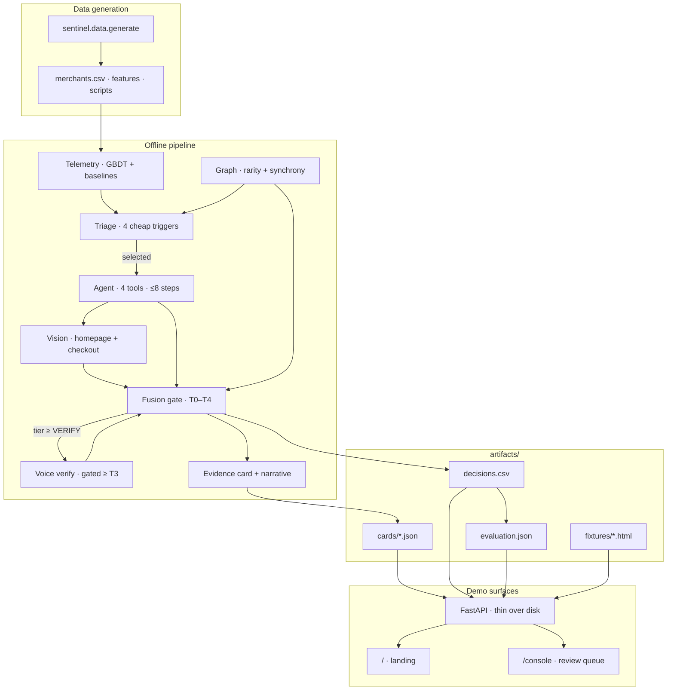
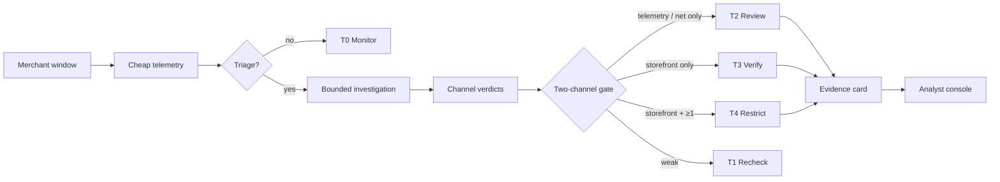

# Architecture

Sentinel is a two-speed merchant-trust system: cheap payment telemetry watches
everyone; expensive channels (vision, agent investigation, graph, voice) run
only when triage earns the spend. A fusion gate turns channel disagreements into
a response ladder (`T0`–`T4`). No single channel can hold settlements.

The demo API and console are **read-only over pipeline artifacts**. Scoring
happens offline; the live surface serves cards, metrics, and fixtures from
`artifacts/`.

---

## System overview

---

## How a merchant is decided

Only **T4** stops money, and only when the storefront channel dissents **plus**
at least one independent corroborator. T3 exists so a single-channel
disagreement has somewhere to go that is not a freeze.

---

## Modules

| Area | Path | Role |
|------|------|------|
| **API** | `sentinel/api/` | Serves landing/console HTML and JSON over disk artifacts. Does not re-score. |
| **Pipeline** | `sentinel/pipeline.py` | Score → triage → investigate → fuse → decide → write cards. |
| **Telemetry** | `sentinel/telemetry/` | Deterministic features, category baselines, GBDT + attribution. |
| **Triage** | `sentinel/triage.py` | Four cheap triggers that earn vision/agent spend. |
| **Vision** | `sentinel/vision/` | Storefront fixtures + VLM/simulator; homepage and checkout. |
| **Agent** | `sentinel/agent/` | Bounded investigation loop over four tools. |
| **Graph** | `sentinel/graph/` | Rarity-weighted shared-infra graph; cohesion + synchrony. |
| **Fusion** | `sentinel/fusion/` | Channel verdicts + response ladder; two-channel hold rule. |
| **Voice** | `sentinel/voice/` | Simulated verification call; only on cases already ≥ T3. |
| **Narrative** | `sentinel/narrative/` | Structured-features-only summary and case copilot. |
| **Data / eval** | `sentinel/data/`, `sentinel/eval/` | Synthetic population; held-out metrics → `evaluation.json`. |
| **Console** | `console/` | Landing overview + analyst review UI. |

---

## Runtime artifacts

| Artifact | Used for |
|----------|----------|
| `artifacts/cards/*.json` | Console queue and case evidence |
| `artifacts/decisions.csv` | Landing population / threshold interactives |
| `artifacts/evaluation.json` | Headline metrics, ablations, economics |
| `artifacts/fixtures/*.html` | Storefront surfaces opened beside findings |
| `artifacts/throughput.json` | Cost / funnel narrative on landing |

Large regenerated inputs (`features_raw.csv`, `merchants.csv`, …) are not
required to run the demo console once cards and evaluation are present.

---

## Request flows

### Landing (`/`)

1. Browser loads `console/landing.html`
2. Client fetches `GET /api/landing` → `decisions.csv` + `evaluation.json`
3. Optional storefront embeds via `GET /api/storefront/{vertical}/{surface}`

### Console (`/console`)

1. Browser loads `console/index.html`
2. `GET /api/queue` lists `artifacts/cards/*.json`
3. Open case → `GET /api/card/{mid}`; storefront → fixtures; ask → `/api/ask`
4. Analyst ruling → `POST /api/decision` → `analyst_decisions.json`

The API never recomputes tiers. Missing artifacts → HTTP 503 with “run pipeline
/ eval first.”

---

## Offline vs live

| Mode | Behaviour |
|------|-----------|
| **Default demo** | Pipeline already run; vision uses an error-model simulator; agent uses a heuristic planner; console is artifact-backed. |
| **Live** (`ANTHROPIC_API_KEY`) | Vision/narrative/copilot can call real models; **re-run the pipeline** to refresh cards. The HTTP surface stays artifact-backed. |

Entry for hosts that look for `main:app` (local uvicorn, Vercel): `main.py`
re-exports `app` from `sentinel.api.app`.
